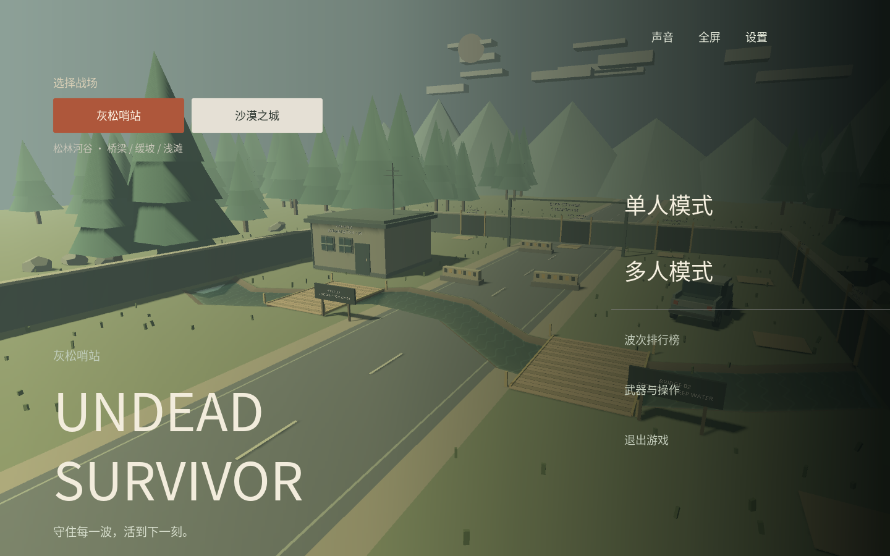
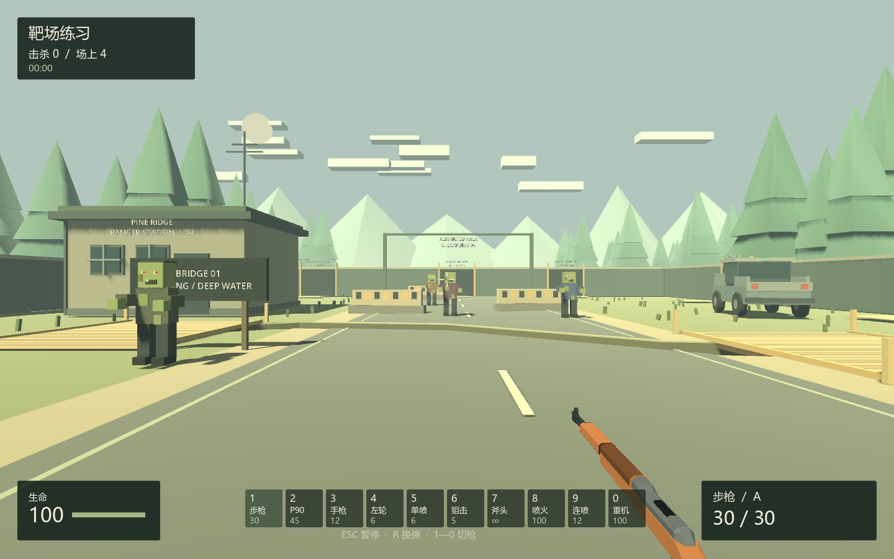

# Undead Survivor · Godot

当前 Godot 版本：`1.7.7`。发布版本由根目录 `VERSION` 管理，Release 使用 `v1.7.7` 这样的版本标签。

`Undead-Survivor` 0.7.7 的独立 Godot 4 原生移植工程。游戏运行时使用 GDScript、Godot 场景、原生网格、着色器和音频，不依赖 React、Three.js、Electron 或浏览器。

移植基线：相邻原项目提交 `7775293140052ccf9f86ea86929bfbc8889a4a5b`。原目录没有修改。

仓库：[xcymm3/Undead-Survivor-Godot](https://github.com/xcymm3/Undead-Survivor-Godot)。[下载最新 Windows 版本](https://github.com/xcymm3/Undead-Survivor-Godot/releases/latest)，推荐 ZIP，解压后运行 EXE。main 分支自动验收与打包成功后会发布 GitHub Release；日志、截图和浏览器回放保存在 Actions Artifacts。自动化入口：`npm run verify` / `npm run verify:release`；完整步骤见 [自动化流程](docs/AUTOMATION.md)。



## 启动

- **直接玩**：双击 `start-game.cmd`。
- **进入编辑器**：双击 `open-editor.cmd`，或用 Godot 4.5.2 打开 `project.godot`，按 F6/F5 运行。
- **Steam 合作**：先登录 Steam，再双击 `start-steam.cmd`。

本机已准备标准 Godot 4.5.2 和 GodotSteam 4.16 / Godot 4.5 运行环境，保存在忽略版本控制的 `.runtime/`。复制项目到其他电脑时，启动脚本会自动下载固定版本、校验 SHA-256 并导入资源。单人和局域网在首次准备完毕后可以离线运行。也可用环境变量 `GODOT_BINARY` 指定现有标准 Godot。

## 已移植的游戏内容

- 原始 44 × 62 米哨站、建筑、车辆、路障、树林、河岸、两座桥、北侧和东侧六个固定刷怪点。
- WASD 移动、±85° 俯仰、原生胶囊体跳跃、空中转向、沿墙滑动、僵尸阻挡；实体河床可涉水，跳跃可拉开与水中僵尸的距离。
- 十款武器的数值、独立弹匣、无限备弹、切换、换弹、自动/半自动攻击、爆头倍率、霰弹扇面、近战多目标和火焰穿透。
- 六款 Quaternius 枪械和原有四款程序化武器；原开火、装填及机械动作已烘焙为原生 GLB 动画。
- 机械瞄具、红点、全息、反射镜、低倍刻度镜、6× 圆形狙击镜；倍率改变真实视野并同步降低鼠标灵敏度。
- 普通、路障、铁桶、小鬼、持盾、狂暴、巨人、橄榄球八类僵尸。护甲脱落、攻击前摇、伤害保护、盾牌正面防御、半血狂暴、范围砸击、锁定方向冲锋与眩晕。
- 原波次数量、阶位权重、速度和刷新上限、刷新安全规则；清波全员恢复、休整三秒、继续下一波。
- 练习模式、正式模式、失败特写、结算、本机前十排行榜、重开、暂停与失焦处理。
- 原始音乐、死亡声和护甲音效转换为 WAV；枪声、火焰、挥砍、装填、受伤和失败声使用本地合成音频。
- 五档画质预设及自定义分辨率、抗锯齿、阴影、特效、视距、帧率、像素化、音量、灵敏度、全屏。
- Steam 房间创建、搜索、房间号加入、真实 Steam 昵称、2～4 人房主权威合作；额外提供原生 ENet 局域网直连。
- 随机角色与配色、队友模型和动画、阵亡观战、切换观战对象、清波复活、全队阵亡结算、断线处理。



## 操作

| 按键 | 功能 |
| --- | --- |
| WASD / 鼠标 | 移动 / 转向与俯仰 |
| 空格 | 单次跳跃；锁定起跳时的移动按键，空中可转向 |
| 左键 / 右键 | 攻击 / 按住瞄准 |
| R | 装填 |
| 1—0 / 滚轮 | 切换十款武器 |
| Esc | 暂停 / 继续；多人时房主模拟持续运行 |
| M / F11 | 静音 / 全屏 |
| 阵亡后左键 | 切换存活队友的第一人称视角 |

首波 9 只。第 1～6、7～8、9～11、12 波以后分别每波增加 6、5、4、3 只。生命值为 100；普通近战造成 10 点伤害，橄榄球冲撞造成 30 点伤害并轻微击退。玩家与僵尸均可涉水，移速为正常的 70%；玩家起跳后恢复正常水平速度，桥面保持正常移速。入水不扣血、不传送。

## 合作

**Steam**：所有人使用本 Godot 工程及 `start-steam.cmd`，使用不同 Steam 账号。房主进入「多人模式」创建房间，队友搜索或输入房间号；至少两人后房主开始。开发 App ID 为 `480`。标准 Godot 没有 Steam 单例时会明确提示使用 GodotSteam。

**局域网**：房主创建局域网房间，复制显示的地址给队友；队友填写昵称及 `房主IP:27777`。跨电脑时需要系统防火墙允许 UDP 27777。`127.0.0.1` 仅用于同机双进程验证。

房主决定位置、血量、弹药、命中和击杀，客户端只发送输入。暂停或切到后台不会暂停合作模拟；后台停止绘制。单人暂停不会累计坚守时间。房主退出后对局结束，不做房主迁移。

**Godot 版使用独立网络协议，不能与原 Electron 版混合联机。** 已完成同机双客户端及四客户端 ENet 实际连接检查；Steam 的接口和运行环境已接入，跨账号、跨电脑 Steam 联网尚待实机验收。

## 工程与资源

```text
project.godot               Godot 工程入口
scenes/main.tscn            原生主场景
scripts/main.gd             游戏生命周期、输入、镜头、观战
scripts/simulation.gd       单人/房主共用的权威模拟
scripts/arena.gd            场景重建、共享地形、碰撞、寻路
scripts/enemy_view.gd       尸群实例化与逐部件命中
scripts/enemy_animation.gdshader  GPU 肢体动画
scripts/session.gd          Steam / ENet 房间和传输
scripts/interface.gd        原生菜单、设置、HUD、结算
assets/data/               原场景几何、碰撞与平衡参数
assets/models/             十款武器 GLB、六款人物 glTF
assets/audio/              本地音乐和音效
tools/                     资源转换、启动、验证和导出工具
docs/PORTING.md             迁移对应关系与验证边界
```

资源已经转换并包含在工程中，正常开发、运行不需要原项目。仅重新提取资源时需要相邻原仓库的 Node 依赖：

```powershell
node tools/convert-assets.mjs ../Undead-Survivor
```

图形使用 Godot Compatibility 渲染器。抗锯齿采用原生 MSAA，光照、粒子和文字由 Godot 重建，因此与 Three.js 的像素结果不同。原地图几何、武器造型和动画姿态保留。详情见 [移植说明](docs/PORTING.md)。

设置和波次榜存放在 `user://survivor-godot-v1.json`，与原浏览器/Electron 存档独立；不会读取、覆盖或伪造原时长榜。

## 验证

后续编辑默认使用下面的后台入口：强制 `--headless` 和 `Dummy` 音频，并通过 `CreateNoWindow` 禁止子进程创建控制台窗口。日志写入工程根目录，超时只结束本次验证进程，不操作已打开的编辑器或游戏。

```powershell
./tools/validate-headless.ps1 -Mode Import
./tools/validate-headless.ps1 -Mode Runtime
./tools/validate-headless.ps1 -Mode Profile
```

双客户端连接检查可在两个终端分别运行（先房主、后客户端）：

```powershell
./tools/validate-headless.ps1 -Mode NetworkHost
./tools/validate-headless.ps1 -Mode NetworkClient
```

GPU 截图默认禁用，不属于自动编辑验证流程。旧截图脚本使用不可见父窗口与 `SubViewport`，但图形进程初始化仍可能闪现窗口，不能保证完全不干扰桌面。只有明确要求视觉验收时才手动启用：

```powershell
powershell -NoProfile -ExecutionPolicy Bypass -File tools/capture-hidden.ps1 -AllowGraphics
```

## 导出 Windows 成品

工程带有 Windows Steam 导出预设。推荐运行完整验收后再打包：

```powershell
npm run verify:release
```

流程使用固定版本的 GodotSteam 导出模板，运行成品 EXE 的无窗口冒烟检查，再生成 `build/Undead-Survivor-Godot-Windows-x64.zip`。包内包含 EXE、`steam_api64.dll`、开发用 `steam_appid.txt`、第三方及字体许可；不要只复制 EXE。正式 Steam 发布须使用自己的 App ID 和对应发布配置。

## 资源来源

六款枪械及六款人物来自 Quaternius 的 CC0 资源；地图、僵尸、四款程序化武器及合成音频来自原项目。许可说明保留在 `assets/models/WEAPON-SOURCES.md`、`assets/models/characters/License.txt` 和 `assets/THIRD-PARTY-NOTICES.txt`。

引擎下载：[Godot 4.5.2](https://godotengine.org/download/archive/4.5.2-stable/)，[GodotSteam 4.16](https://github.com/GodotSteam/GodotSteam/releases/tag/v4.16)。
