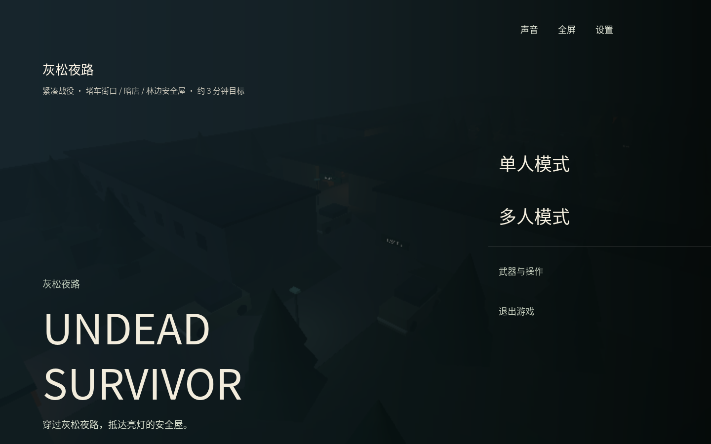

# Undead Survivor · Godot

当前版本 **1.12.0**，包含 **灰松夜路** 和 **保卫水晶**。夜路目标是在约三分钟内穿过堵车街口、暗店和林缘，进入安全屋；水晶防守则从吊桥对岸刷新僵尸，拉下拉杆后开始十波进攻。

[下载 Windows 单文件 EXE](https://github.com/xcymm3/Undead-Survivor-Godot/releases/latest)。无需另下 DLL；游戏与 Steam 依赖内置，运行时释放到临时目录，退出后清理。

## 玩法与操作

单人开局预置 200 只僵尸，分布在道路、店铺、遮挡后与树林中；接近或局部枪声会惊动它们。定时与事件增援生成有限批次，安全条件不满足时保留数量、延后投放。无需清光地图，进入终点安全屋并按住 E 关门即可完成。

普通、路障、铁桶及橄榄球僵尸速度在 4.6～5.2 米/秒之间随机，超过玩家的 4.2 米/秒；小鬼为 5.96～6.74 米/秒，狂暴僵尸常态同普通、狂暴后固定 7.2 米/秒，橄榄球冲锋为 12 米/秒。尸群使用分散接敌目标和局部分离；狭窄通道仍需依次通过。近战前摇期间僵尸继续有限转向推进，伤害帧后停止，直线后退不能让更快敌人反复挥空，横向闪避仍可脱离攻击。奔跑、攻击前摇和挥击采用原生骨骼姿态，空间音效区分蓄力、命中与挥空。

| 操作 | 按键 |
| --- | --- |
| 移动 / 转向 | WASD / 鼠标 |
| 跳跃 / 蹲下 | 空格 / Ctrl |
| 攻击 / 推击 | 左键 / 右键 |
| 切换开镜 | 中键 |
| 换弹 | R |
| 主武器 / 副武器 / 消防斧 | 1 / 2 / 3 |
| 手雷 / 医疗包 | 4 / 5 |
| 拾取、开关门、救援 | 按住 E |
| 暂停 / 静音 / 全屏 | Esc / M / F11 |

相邻推击间隔不超过三秒时累计次数，第三次推击触发 3.5 秒冷却，准星上方圆环显示恢复进度。推击会中断换弹，不补发未装填子弹。医疗包右键用于治疗近处队友，左键治疗自己，治疗期间无法行动。

补给点生成玩家人数两倍的枪械，通过换枪获得新弹药；每人最多携带一个手雷和一个医疗包。手雷投出三秒后爆炸，当前不伤害自己或队友。前段补给为 B 级，林缘补给为 A 级。所有枪械均无第一人称手臂，左轮保留枪械自身的持握、晃动、瞄准、射击、换弹与中断动作。

## 合作

支持 Steam 房间和原生 ENet 局域网直连。房主决定位置、血量、命中与击杀，客户端只发送输入。合作倒地可以救援，死亡后本关不复活；房主退出则对局结束。房间上限仍为四人，本轮及后续仅检验单人与双人。

Steam 合作需登录 Steam；开发 App ID 为 480。局域网加入地址为房主 IP:27777。Godot 版不能与原 Electron 版混合联机。Steam 跨账号和跨电脑体验尚待实际验证。

## 开发与验证

本项目是独立 Godot 4 原生工程，运行时不依赖 React、Three.js 或浏览器。双击 start-game.cmd 启动，open-editor.cmd 打开编辑器，start-steam.cmd 启动 Steam 版本。固定引擎为 Godot 4.5.2，发布使用匹配的 GodotSteam 模板。

- npm run verify：日常基础检查，只执行版本、资源导入和原生组件断言。
- npm run verify:full：仅在用户明确要求验收或全量测试时，执行整关、联网、Web 导出和浏览器回归。
- npm run verify:release：打包 EXE 前自动执行全量测试，再完成 Windows 导出、成品冒烟和 ZIP 打包。

基础报告会明确列出未运行项目，不视为全量、视觉或发布验收通过。截图和视觉复查只在用户明确要求时执行。
- 不再运行旧地图或三人、四人测试。所有本机自动检查均无窗口，不捕获鼠标或干扰桌面。
- Actions 全绿后发布单 EXE、ZIP、版本和校验和；当前源码摘要门禁须通过后才提交。

单人固定受限输入样本用于约三分钟的合成校准；双人整关角色熟悉路线。自动通过不代表真人时长、趣味性或难度达标。软件截图不替代原生 GPU 验收，静音测试不验证实际音效听感。

设计与验证细节：[夜路](docs/NIGHT_ROUTE.md)、[近身战斗](docs/CLOSE_COMBAT.md)、[地图入口](docs/MAPS.md)、[自动化](docs/AUTOMATION.md)、[按需视觉检查](docs/VISUAL_QA.md)。

## 资源与许可

六款枪械及人物资源来自 Quaternius CC0 素材；地图、僵尸、程序化武器和合成音频来自原项目及本工程。许可见 assets/THIRD-PARTY-NOTICES.txt、assets/models/WEAPON-SOURCES.md 和人物目录许可。正常运行不需要相邻原项目；转换工具仅用于开发，不修改相邻项目。

本版枪声与子弹落点会引来僵尸调查，发现玩家后追击；增援成组入场。终点三批有限尸潮共 54 只（双人 66 只），受安全出生条件限制时保留队列继续投放。
