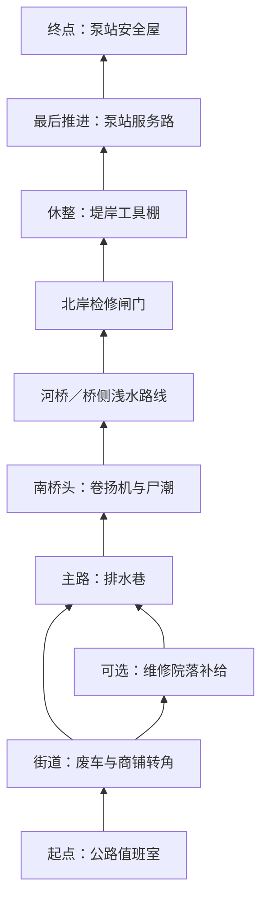

# 第一关：灰松渡口

状态：第一关已按本稿接入原生工程，实现与测试边界见 [CAMPAIGN_IMPLEMENTATION.md](CAMPAIGN_IMPLEMENTATION.md)。本稿保留设计目标；尺寸、时长与预算仍需人类试玩校准，不能视为已经完成的平衡验收。

## 1. 体验目标

1～4 人从公路值班室安全屋出发，沿废弃街道到达河边，启动卷扬机打开对岸检修闸门，穿过河桥抵达泵站安全屋。玩家应经历观察路线、移动作战、选择补给、协同防守和带伤撤离。

普通难度首次成功通关目标为 8～12 分钟，从起点开门开始计时，到终点关门结算结束；起点准备、暂停和失败重试不计入。熟练玩家可以更快完成，不使用等待计时强行凑满八分钟。

第一关保留现有射击、跳跃、涉水和敌人辨识。以普通、路锥、铁桶僵尸为主，少量小鬼和盾牌僵尸改变交战角度，桥头安排一次橄榄球僵尸出场。首版不安排巨人和狂暴者，也不加入抓取控制技能。

## 2. 空间布局

新建独立地图 `graypine_ferry`，复用哨站的材质、植被、河桥和道具语言。现有哨站约 44×62 米，直接在两端放门不足以支撑本关路线，应制作新场景。

建议地图边界为 160×280 米，主要推进方向为北。主路线沿弯曲街道和堤岸展开，中心线总长约 340 米；院落支线额外增加约 45 米。二维导航空间内不设计上下重叠的可走楼层。坐标以 X 向东、Z 向南，起点约 (0, 115)，终点约 (25, -125)。坐标用于布局，最终以白盒实测调整。

| 区域 | 建议位置 / 尺寸 | 布局要点 |
| --- | --- | --- |
| 起点值班室 | (0,115)，室内 10×8 米 | 四人可绕行，补给靠侧墙；出门可见街道标识 |
| 废弃街道 | (0,70)，约 65×65 米 | 道路宽 7～10 米，两次转角截断视线；废车之间留 3 米通路 |
| 维修院落 | (-45,40)，约 24×22 米 | 支线入口能看见医疗标识；第二出口接回排水巷，绕路有回报 |
| 排水巷 | (8,20)，宽 4～6 米 | 转角后首次看到桥与泵站地标；避免狭窄门洞连续堆叠 |
| 南桥头 | (0,-15)，约 32×24 米 | 卷扬机位于侧边；两块掩体形成可绕行环路，不能只有单一背墙守点 |
| 河桥与浅水 | 河道约 Z=-40，横贯地图 | 桥长约 18 米、宽 5 米；桥侧保留缓坡、涉水代价和返回路径 |
| 北岸闸门 | (0,-57)，净宽 5 米 | 闸门横断唯一检修通道；封闭围墙延伸到地图实体边界 |
| 工具棚 | (20,-78)，约 12×10 米 | 可暂避视线，提供有限补给；没有安全屋保护 |
| 泵站服务路 | (25,-103)，约 65 米曲线路程 | 先看见终点标志，再经一道转角到门口 |
| 终点安全屋 | (25,-125)，室内 12×10 米 | 入口净宽 3 米，门内留 4 米缓冲，四人同时进入不堵塞 |

闸门必须通过真实围墙、护栏和不可攀越地形阻断绕行，墙顶高于角色最大跳跃高度并留余量。玩家可以提前涉水到北岸门前，但无法绕过闸门进入后半关。不得用空气墙、入水传送或临时取消涉水来解决事件跳过。

## 3. 流程与时间预算

| 段落 | 时间目标 | 玩家行动与压力变化 |
| --- | --- | --- |
| 开门与辨认路线 | 0:30～0:45 | 出门看见远处泵站标志，处理少量游荡者，学习目标提示 |
| 街道遭遇 | 1:45～2:15 | 两个小规模接触点；绕车射击、侧移处理盾牌，转角后短暂清静 |
| 院落选择与排水巷 | 1:00～1:45 | 直接走主路约一分钟；探索院落额外约 30～45 秒，获得医疗和弹药 |
| 桥头事件与过河 | 2:15～2:45 | 接近、确认控制台、90 秒开门事件、穿过桥或浅水、越过闸门 |
| 工具棚休整 | 0:30～0:45 | 恢复、换弹、确认终点方向；不自动回满血 |
| 泵站最后推进与关门 | 2:00～2:45 | 有限追击加前方散兵，带队进入安全屋，不要求清空全图 |
| 合计 | 8:00～11:00 | 额外观察、救援与初次迷路可将流程延长至约 12 分钟 |

时长主要来自交战、搜集和路线判断。若实测过短，优先改进接触点和探索价值；若过长，先检查找路、敌人血量和堵塞，避免直接增加敌人数量。

## 4. 各段遭遇

### 值班室与街道

起点门关闭时不刷怪、不计时；每人可选择一把现有主武器和一把近战武器，不能通过切换其他枪械获取十套免费弹匣。单人不强制加入 AI 队友。所有加载完成的玩家都在室内后，任一玩家交互开门开始本关，起点此后不能重新成为无敌据点。

第一接触点只出现普通僵尸，给玩家观察和练习移动射击的空间。第二接触点在废车后加入路锥、铁桶及一名盾牌僵尸，保留侧路绕射，不把高护甲敌人放在唯一窄门里。

街道结束后不立刻从背后补满敌人。前方的桥头电机和泵站轮廓承担引导，地面箭头与文字标识补充方向，不全程显示穿墙路径。

### 可选维修院落

入口敞开，医疗标识和弹药箱从主路可见。院内少量敌人预先存在；取物不会凭空触发包围。玩家清理后从第二出口回主路，也可原路撤回。

奖励是额外治疗和弹药，不是主线钥匙。略过院落应可通关；探索院落应降低桥头资源压力。补给点不能通过反复进出区域刷新。

### 河桥事件

目标文字依次为“启动桥头卷扬机”“守住桥头，等待检修闸门打开”“穿过北岸闸门”。控制台位于南岸，电缆跨桥通向北岸闸门；闸门本身是进度可视反馈。

玩家靠近控制台按住交互 2 秒，松开或离开范围只取消启动读条。成功启动后事件持续 90 秒，无需一人一直按住按钮，也无需寻找随机燃料。声音和警灯提前 5 秒提示第一批尸潮。

| 事件时间 | 行为 |
| --- | --- |
| 0～5 秒 | 电机启动，展示闸门缓慢抬升；提示可绕掩体防守 |
| 5～30 秒 | 第一批从街道方向和南岸遮挡后进入，建立正面压力 |
| 30～40 秒 | 停止新增事件敌人，保留场上追击，提供换弹空隙 |
| 40～65 秒 | 第二批加入少量小鬼；最多一名橄榄球在鸣叫预警后出现 |
| 65～75 秒 | 第二次生成间隔；受压过高时取消未生成的橄榄球 |
| 75～90 秒 | 最后一批普通僵尸，闸门接近开启，目标引导转向北岸 |
| 90 秒 | 闸门完全开启，停止新增事件敌人；残余敌人仍可追击 |

开门由计时决定，不要求消灭最后一只敌人；不可达敌人不能卡住任务。闸门在本次尝试内保持开启，落后队友不会被关在另一侧。事件期间重复交互不会重置计时或重复生成敌人。

桥面是快路线，浅水是减速绕行路线，可避开桥上的拥堵与冲锋。敌人与玩家共用河岸和闸门状态；橄榄球继续遵守现有水中行为。生成逻辑不得为围堵涉水玩家而直接在水面上生成敌人。

### 工具棚与终点

所有未死亡队员越过北岸闸门后，给予 25 秒不新增主动尸潮的恢复期；已有敌人不会消失，停留时间也不强制暂停流程。工具棚有少量医疗和一次性弹药，不能关门变成安全屋。

进入泵站服务路后激活一次有限追击。终点附近预设散兵从正面接触，追击从身后现有遮挡入口进入；两侧保持脱离路线，禁止在门口生成盾牌或橄榄球堵门。

所有未死亡队员进入终点房间、没有活敌人在室内时，任一站立玩家可按住交互 1 秒关闭门并获胜。场外敌人不影响结算。倒地队员仍计为未死亡，必须救起再进入；已死亡玩家不阻止过关。门口有玩家或敌人占位时，关门取消并提示原因，不能夹死实体或将队员传送入内。

## 5. 敌人调度与难度

战役不用波次数提升敌人速度或血量。首轮普通僵尸速度可从 1.8 米/秒起调，其余沿用现有种类差异；敌人血量先复用当前数值，再依据击杀时间调试。本关的敌人类型和预算由独立战役配置控制，不修改生存模式规则。

以下预算为单人基准，包含预置与动态生成的敌人，是每段上限，不要求全部生成或击杀。

| 段落 | 单人总预算 | 类型约束 |
| --- | --- | --- |
| 值班室外 | 6 | 全普通 |
| 街道 | 22 | 铁桶最多 2，盾牌最多 1 |
| 院落支线 | 8 | 路锥最多 2，无橄榄球 |
| 排水巷及桥头接近 | 10 | 铁桶最多 1 |
| 90 秒桥头事件 | 48 | 分配为 16 / 20 / 12；小鬼最多 4，橄榄球最多 1 |
| 泵站最后推进 | 22 | 小鬼最多 2，无盾牌堵门，无橄榄球 |

2 / 3 / 4 人普通敌人预算乘数为 1.5 / 1.9 / 2.3，按段四舍五入；不叠加敌人血量倍增。橄榄球仍最多一只。活动敌人总上限初值为 18 / 28 / 36 / 44，计入当前仍在追击的前段敌人。桥头生成速率上限分别为 1 / 1.5 / 1.9 / 2.3 只每秒。

预算根据开门时实际人数固定；有人断线时仅下调剩余预算和上限，不回收已出现敌人、不再向上补发。首版不支持途中加入和断线重连，加入入口明确提示等待下一局。

刷怪点必须距所有未死亡玩家至少 12 米、在所有玩家可见区域之外，并存在通向目标的有效路径。门后和转角提供候选区域；不得仅以距离检查代替视线检查，也不允许出生在安全屋、封闭闸门内或玩家撤退脚下。开门后可达性变化必须同步到寻路。

没有合规点时跳过本次生成机会，保留预算但不累计瞬时生成额度；时间窗口结束后丢弃该窗口未生成预算。不开启全局无限追杀，也不要求把预算刷完才通关。

轻量压力控制只需两档：任一玩家倒地，或站立队员平均血量低于 35 时，暂停新增侧后方敌人 8 秒，并取消该窗口尚未生成的精英；最多每 25 秒触发一次。不会清除现有敌人、恢复玩家血量或推迟开门时间。

## 6. 补给、倒地与失败

以下均为新增战役能力，当前工程没有因此自动具备背包、储备弹药或救援系统。

- 每人一把主武器、一把现有近战武器；主武器出发时满弹匣，并携带相当于 5 个弹匣的储备弹药，储备上限为 6 个弹匣。换弹从储备扣除，切枪不会补弹。
- 弹药点对每位玩家可领取一次，每次补充 2 个弹匣等量的储备，不能超过上限。院落、桥头、工具棚各设一处；点位的个人领取记录由房主管理。
- 每人出发携带 1 个医疗包，携带上限 1 个。使用需连续 3 秒，恢复 50 血且不超过 100；受伤取消，成功完成才消耗。首版只支持对自己使用，队友救援单独交互。
- 院落额外医疗包数量为人数向上取整的一半；工具棚固定 1 个，全队共享领取。医疗包不随机掉落，避免靠刷怪无限续航。
- 合作玩家生命归零后倒地，不能移动和射击，30 秒后死亡；队友在 2 米内按住交互 4 秒救起，恢复 30 血。施救者受伤或离开范围中断，松开后读条归零。倒地计时在有效施救期间暂停，取消后恢复。
- 每位合作玩家每关最多被救起两次，第三次生命归零直接死亡。首版倒地期间不再承受额外敌人伤害；敌人改选站立目标，避免救援必然失败。
- 单人生命归零直接失败，不等待无法完成的救援；通过更低预算和压力控制保持可玩性。合作没有站立队员时立即失败，不空等倒地计时。
- 死亡后观战，本关中途不复活；过关后参与下一关时恢复。团灭从起点重开，清空本次敌人、拾取和事件进度；首版无中途存档。

控制台启动、安全屋关门、领取和治疗均使用同一交互键，根据距离与视线选择目标并显示动作名称。倒地救援优先于地面补给；同一物品的并发领取必须由房主裁决。

## 7. 引导、声音与画面

采用阴天傍晚的河谷工业边缘环境，保持现有美术语言。起点是暖色室内光，街道为灰绿色环境，卷扬机使用橙色工作灯，终点以清晰的灯光和“泵站避难点”文字识别。颜色只作辅助，图形和文字必须同时成立。

至少在出门、街道末端、桥头和工具棚出口各有一个可辨认的下一目标。远处泵站水塔保持地标连续性；不要靠浓雾遮住引导目标。转角负责遮蔽刷怪与控制战斗距离。

HUD 保留血量、武器和队友信息，战役区域显示当前目标、主武器储备和医疗包。桥头显示开门进度；终点显示“等待队友 2/3”等实际条件。不显示生存波次，也不以剩余敌人数引导清图。

声音按电机启动、敌人到来、闸门开启区分，橄榄球先预警再进入攻击范围。尸潮期间仍需听清受伤、倒地和换弹，音量优先级在实机验收中检查。

## 8. 工程实现边界

| 模块 | 需要的工作 |
| --- | --- |
| 地图目录与场景 | 在 `map_catalog.gd` 注册独立地图；新增原生场景、实体边界、出生区、补给点和目标区 |
| 地形与导航 | 将河流剖面从 `outpost` 特判抽成地图配置，复用涉水和高度规则；闸门碰撞、导航阻断与开启状态一致 |
| 共享模拟 | `simulation.gd` 保留权威移动、命中和伤害；将波次调度与战役调度分离，新增储备弹药、交互和救援状态 |
| 战役控制 | 建议新增 `campaign_director.gd` 和本关配置，处理状态、区域预算、事件时钟和结算；随机数由房主统一驱动 |
| 联机 | `session.gd` 扩展模式、章节、事件、补给、倒地和完成状态的快照与校验；客户端仅提交交互意图 |
| 界面 | 模式选择、战役目标、补给提示、救援读条和独立通关结算；不写入生存波次排行榜 |

状态流程：`PREPARE → STREET → BRIDGE_READY → BRIDGE_ACTIVE → GATE_OPEN → FINAL_APPROACH → COMPLETE`。所有活动阶段都可进入 `FAILED`。院落是可选区域标志，不是必经主状态。进入后段不删除落后玩家周围的前段敌人。

终点获胜只发生一次；获胜后冻结伤害和敌人生成。房主退出沿用会话结束流程并解释原因，首版不新增主机迁移。重复或过期交互包、重复区域进入、断线事件不得回退进度或重复发奖励。

推荐制作顺序：先完成路线白盒与安全屋闭环，再接桥头事件和敌人调度，然后实现战役资源与救援，最后完成美术、声音和节奏调试。前两步只算流程样机，不能声称完整设计已交付。

## 9. 验收计划

### 功能与联机

运行 `npm run verify` 与提交前 `node tools/automation.mjs --check-report`。实现本关时增加以下有行为意义的检查，保留现有两张地图及生存模式回归：

1. 单人及 ENet 2/4 人从起点到终点完成流程，开门时间一致，重复交互不重复触发，结算仅一次。
2. 直接走主线与探索院落都能过关；出生点无效、敌人不可达、未清空敌人均不阻塞闸门或过关。
3. 桥、两岸缓坡、涉水、跳跃和闸门关闭/开启状态下的玩家碰撞与敌人寻路一致；不能从墙边、浅水和跳跃绕过闸门。
4. 队员分散在两岸时不在任何人眼前刷怪；事件生成失败不累计补刷；敌人数量不超过上限。
5. 弹药不会凭空补满；同时拾取只产生一次有效共享物品领取；救援取消、死亡、断线和全员倒地均有确定结果。
6. 终点等待落后或倒地队友，已死亡队友不阻塞；门口占位与屋内残敌有提示，清除后可关门。
7. 失败重开无残留敌人、已领取记录或闸门进度；战役结果不污染生存排行榜。

本地 ENet 结果不代表 Steam 双账号验收；后者单列待实测。

### 节奏试玩

在获授权的试玩环境中，分别记录单人、双人、四人的成功时长、各段耗时、剩余弹药、用药、倒地、迷路和死亡位置。每个人数至少收集 5 次普通难度成功通关样本，并保留失败样本，不只统计最快一局。

目标为首次成功流程的中位时长在 8～12 分钟；工具棚能出现可感知的恢复机会；略过院落仍可通关。熟练路线速通不受八分钟下限约束。若失败集中在同一不可读角落或救援堵点，先修布局与提示，再调整数值。

### 视觉质量

按 `docs/VISUAL_QA.md` 的逐图审查矩阵执行，追加起点出门、院落入口、卷扬机交互、尸潮桥头、两岸水面接缝、关闭和开启的闸门、工具棚出口、四人终点聚集及结算画面；检查 960×540、1440×900、1920×1080 下的目标文字和交互提示。

该文件中的 `capture-hidden.ps1` 流程与当前 `AGENTS.md` 禁令冲突，不能使用；隐藏父窗口或离屏 SubViewport 均不能作为本机截图替代方案。本机仅运行真正 headless 检查，GPU 取图须使用另行获授权的隔离环境。实际打开截图并记录发现、修复、复查；截图生成和功能检查不能替代视觉质量审查。

当前验收状态：本关已接入内部输入遍历、边界规则测试和软件 Web 取图；最新结果见 artifacts/campaign-acceptance.json 与 artifacts/visual-review.md。GPU 视觉质量、连续运动手感、8～12 分钟真人节奏和 Steam 双账号合作均待验收。
